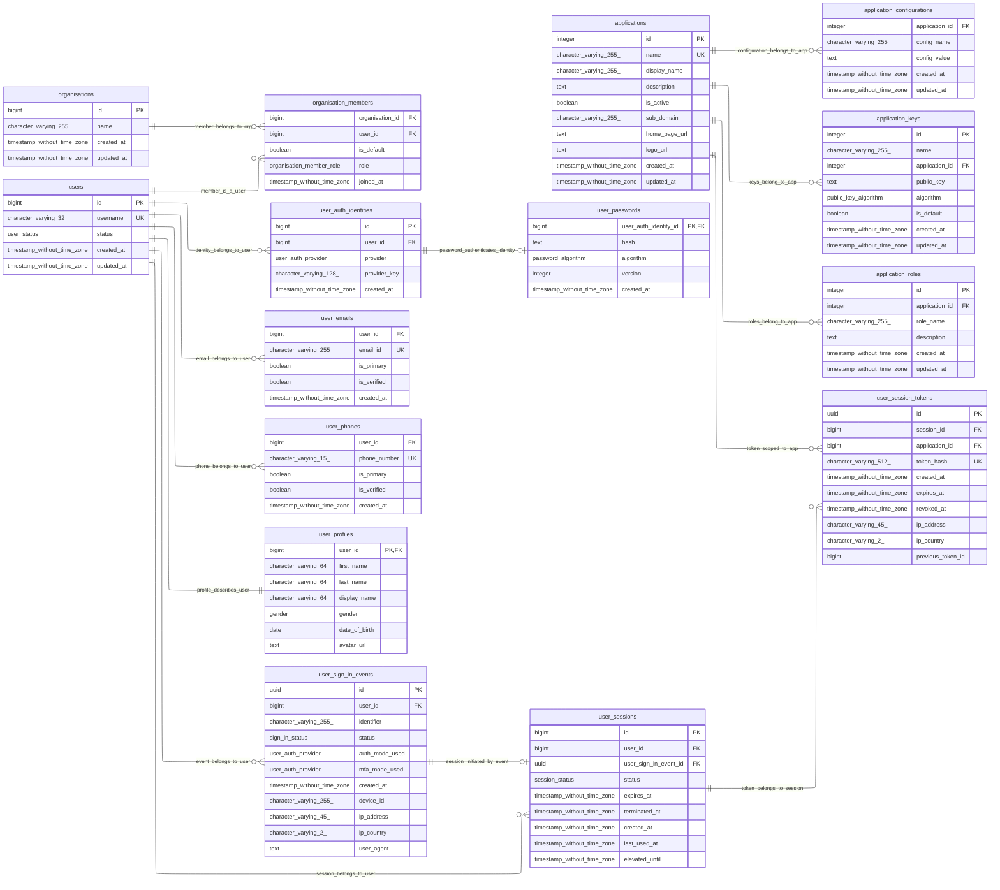

# Database Schema Documentation

This document outlines the database architecture for the Identity and Access Management (IAM) system. The schema is designed to support a centralized authentication provider (similar to Google/Microsoft Accounts), handling multi-tenancy, multiple authentication providers, and secure session management.

## Visual Schema

## 1. User Core Domain

These tables handle the fundamental data regarding a user entity.

| Table               | Description                                                                                                                                             |
| :------------------ | :------------------------------------------------------------------------------------------------------------------------------------------------------ |
| **`users`**         | The central anchor table. It contains the minimal unique identifier (`id`, `username`) and the account status (Active, Suspended, etc.).                |
| **`user_profiles`** | A 1:1 extension of the user table containing personal details like Name, Gender, DOB, and Avatar. Separating this allows `users` to remain lightweight. |
| **`user_emails`**   | Stores email addresses associated with a user. Supports multiple emails per user, with flags for `is_primary` and `is_verified`.                        |
| **`user_phones`**   | Stores phone numbers. Similar to emails, supports multiple entries per user for recovery or MFA purposes.                                               |

## 2. Authentication Domain

This domain separates the _User_ (who they are) from the _Method_ (how they prove it).

| Table                      | Description                                                                                                                                                                 |
| :------------------------- | :-------------------------------------------------------------------------------------------------------------------------------------------------------------------------- |
| **`user_auth_identities`** | This is the pivot point for login methods. A user can have multiple identities (e.g., one for "Password" auth, one for "Google OAuth", one for "GitHub").                   |
| **`user_passwords`**       | Stores hashed passwords. **Crucially, this links to `user_auth_identities`, not `users`.** This treats "Password" as just another provider type, making the system modular. |

## 3. Session & Security Domain

These tables manage the active state of users and audit their access.

| Table                     | Description                                                                                                                                                                                  |
| :------------------------ | :------------------------------------------------------------------------------------------------------------------------------------------------------------------------------------------- |
| **`user_sign_in_events`** | An immutable audit log of every login attempt. Tracks IP, Device, Country, User Agent, and the specific Auth/MFA modes used.                                                                 |
| **`user_sessions`**       | Represents a continuous period of activity. A session is created upon a successful `sign_in_event`. It tracks the session lifecycle (Active, Terminated) and "sudo mode" (`elevated_until`). |
| **`user_session_tokens`** | The actual artifacts (Refresh Tokens) issued to the client. This allows token rotation (refreshing the access token) and revocation without destroying the underlying session data.          |

## 4. Application Domain (OIDC/OAuth Clients)

Since this system acts as an Identity Provider (IdP), other services ("Applications") rely on it for user data.

| Table                            | Description                                                                                                      |
| :------------------------------- | :--------------------------------------------------------------------------------------------------------------- |
| **`applications`**               | Represents a client application (e.g., "My ToDo App", "Company Portal") allowed to use this Auth Server.         |
| **`application_keys`**           | Stores public keys or secrets used for signing JWTs or verifying requests specific to an application.            |
| **`application_configurations`** | A key-value store for app-specific settings (e.g., allowed redirect URIs, theme preferences).                    |
| **`application_roles`**          | Defines roles specific to that application (e.g., "Admin" within the "ToDo App"), allowing RBAC per application. |

## 5. Organization Domain

Supports grouping users into teams or companies (Multi-tenancy).

| Table                      | Description                                                                                                                     |
| :------------------------- | :------------------------------------------------------------------------------------------------------------------------------ |
| **`organisations`**        | The entity representing a company or team.                                                                                      |
| **`organisation_members`** | A join table linking `users` to `organisations`. Includes the user's role _within that organization_ and default context flags. |

---

### Key Architectural Decisions

- **Identity Separation:** By separating `users` from `user_auth_identities`, we can easily add new providers (Apple, Facebook, SAML) without altering the core user table.
- **Session vs. Token:** Splitting `user_sessions` (logical state) from `user_session_tokens` (physical artifacts) allows for high-security features like "Revoke all tokens for this session" or detecting token theft via reuse (using `previous_token_id`).
- **Auditability:** The `user_sign_in_events` table ensures strict compliance logging for security audits.
